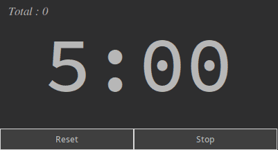
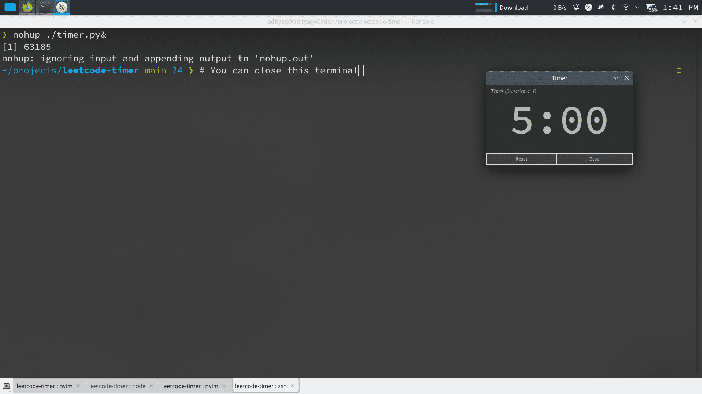
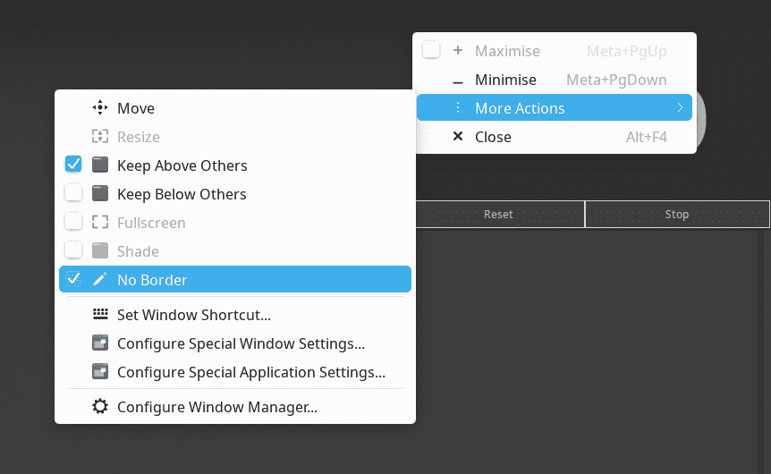

# Timer App

Simple timer app, doesn't fetch anything from leetcode, written in tkinter.

Why Not use existing timers ?
- I tried, but they didn't 'feel' good, or overkill
- Modified using/inspired from https://github.com/fatihbahadir/PomodroTimer

Color codes used from defaults in nanogui library (accha colors hai :)

## Usage

* Reset: Resets the timer to whatever time you set in self.t (default 300s, ie. 5 minutes), and next timer starts
* Stop:  Stop the timer for now

> 5 minutes for thinking time, isliye default rakha hu

### Setting custom time limit

Pass the number of minutes as argument, eg. `./timer.py 6` for 6 minutes reset
time

### How I use

Step 1: Start the timer, either from terminal, or I use .desktop file, so I can start it as any other application

Step 2: Stick to top, and remove Titlebar... is se aur chhota aur simple dikhta hai : )
        In KDE:

